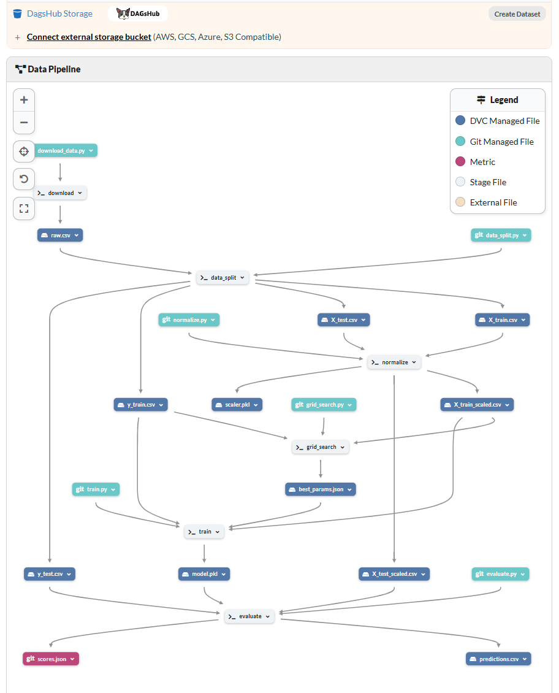

# Exam DVC with Dagshub

**Name:** Frank Lee
**Email:** lee.frank.david@gmail.com

**Repositories:**

- DagsHub: https://dagshub.com/codeByFrank/examen_dvc
- GitHub: https://github.com/codeByFrank/exam-dvc

---

## Assignment

This evaluation consists of four parts. We work with a dataset containing information about mineral processing, specifically focusing on the flotation process used to concentrate silica from ore.

### Task Requirements

**Create a virtual environment where you will work throughout the exam.**

#### 1. Script Creation

The first step is to build the necessary scripts for the workflow of this modeling project. We expect to have at least 5 scripts, each targeting the following steps:

1. **Data Splitting**: Split the data into training and testing sets. Our target variable is `silica_concentrate`, located in the last column of the dataset. This script will produce 4 datasets (X_test, X_train, y_test, y_train) that you can store in `data/processed`.

2. **Data Normalization**: As you may notice, the data varies widely in scale, so normalization is necessary. You can use existing functions to construct this script. As output, this script will create two new datasets (X_train_scaled, X_test_scaled) which you will also save in `data/processed`.

3. **GridSearch for Best Parameters**: Decide on the regression model to implement and the parameters to test. At the end of this script, we will have the best parameters saved as a `.json` file in the `models` directory.

4. **Model Training**: Using the parameters found through GridSearch, we will train the model and save the trained model in the `models` directory.

5. **Model Evaluation**: Finally, using the trained model, we will evaluate its performance and make predictions. At the end of this script, we will have a new dataset in `data` containing the predictions, along with a `scores.json` file in the `metrics` directory that will capture evaluation metrics of our model (e.g., MSE, R2).

---

## Project Overview

This project implements a complete DVC pipeline for mineral processing analysis, specifically focusing on the flotation process to predict silica concentration.

## Pipeline Architecture



### Pipeline Stages

1. **download** - Downloads raw data from AWS S3
2. **data_split** - Splits data into training (80%) and testing (20%) sets
3. **normalize** - Normalizes features using StandardScaler
4. **grid_search** - Performs GridSearchCV to find optimal hyperparameters
5. **train** - Trains RandomForestRegressor with best parameters
6. **evaluate** - Evaluates model performance and generates metrics

### Model Performance

- **R² Score:** 0.22474966906923366
- **RMSE:** 0.8808687565186699
- **MAE:** 0.6765238083268064

### Project Structure

```
examen-dvc/
├── data/
│   ├── raw/              # Raw downloaded data
│   └── processed/        # Processed and split data
├── src/
│   ├── data/
│   │   ├── download_data.py
│   │   ├── data_split.py
│   │   └── normalize.py
│   └── models/
│       ├── grid_search.py
│       ├── train.py
│       └── evaluate.py
├── models/
│   ├── model.pkl         # Trained model
│   └── data/
│       └── best_params.json
├── images/
├── metrics/
│   └── scores.json       # Evaluation metrics
├── .dvc/
├── dvc.yaml              # DVC pipeline definition
└── dvc.lock              # DVC pipeline lock file
```

### How to run

# 1. Create virtual environment

python -m venv .venv
source .venv/bin/activate # Windows: .venv\Scripts\activate

# 2. Install dependencies

pip install -r requirements.txt

# 3. Run complete pipeline

dvc repro
